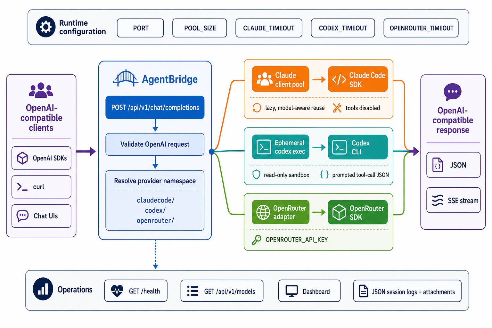

<div align="center">
  

  **🌉 Bridge OpenAI tools to Claude Code SDK, Codex CLI, or OpenRouter — use your subscriptions anywhere 🔌**
</div>

agentbridge is a local API bridge for developers who want to connect OpenAI-compatible apps to Claude Code, Codex, or OpenRouter. Run one server, choose a backend with a namespaced model ID, and point existing Chat Completions clients at `http://localhost:8082/api/v1`.

It supports streaming and non-streaming responses, image and PDF inputs where the backend accepts them, OpenAI-style tool calls, a live dashboard, and local JSON session logs.

> **Legal notice:** agentbridge can use Claude Code SDK and Codex CLI access through your local subscriptions, and can forward requests to OpenRouter when configured. You are responsible for determining whether your use complies with each service's terms. Use it conservatively and at your own risk.

## Install

```bash
uv tool install agentbridge-py
agentbridge
```

Open the [dashboard](http://localhost:8082/dashboard), try the built-in [chat](http://localhost:8082/dashboard/chat), or use `http://localhost:8082/api/v1` as an OpenAI-compatible base URL.

Authenticate at least one backend before sending requests:

```bash
claude login    # for claudecode/* models
codex login     # for codex/* models
```

For OpenRouter, start agentbridge once and add `OPENROUTER_API_KEY` to `~/.config/agentbridge/.env`.

To work on the repository itself:

```bash
git clone https://github.com/tsilva/agentbridge.git
cd agentbridge
uv sync --extra test
uv run agentbridge
```

## Usage

```bash
curl http://localhost:8082/api/v1/chat/completions \
  -H "Content-Type: application/json" \
  -d '{"model":"claudecode/sonnet","messages":[{"role":"user","content":"Hello!"}]}'
```

Every request requires one of these model namespaces:

- `claudecode/<model>` — `opus`, `sonnet`, `haiku`, or a namespaced Claude slug containing one of those names.
- `codex/<model>` — passed directly to Codex CLI. `gpt-5.6-sol` and `gpt-5.5` default to high reasoning effort unless the request overrides it.
- `openrouter/<provider>/<model>` — passed to the official OpenRouter Python SDK.

OpenAI SDKs may use any placeholder API key:

```python
from openai import OpenAI

client = OpenAI(base_url="http://localhost:8082/api/v1", api_key="not-needed")
response = client.chat.completions.create(
    model="codex/gpt-5.6-sol",
    reasoning_effort="high",
    messages=[{"role": "user", "content": "Hello from Codex!"}],
)
print(response.choices[0].message.content)
```

## Commands

```bash
agentbridge                                           # start on 127.0.0.1:8082
agentbridge --port 8083                               # choose another port
agentbridge --workers 3                               # set Claude pool and Codex concurrency to 3
agentbridge --version                                 # print package and git version
uv run --frozen --extra test pytest -q                # run tests
uv run --frozen --extra test ruff check agentbridge tests  # lint Python
uv lock --check                                       # verify the lockfile
uv build                                              # build wheel and source distribution
```

## Notes

- Python 3.12+ and at least one authenticated backend are required.
- Public routes are `POST /api/v1/chat/completions`, `GET /api/v1/models`, `GET /health`, `/dashboard`, and `/dashboard/chat`.
- `PORT`, `POOL_SIZE`, `CLAUDE_TIMEOUT`, `CODEX_TIMEOUT`, and `OPENROUTER_TIMEOUT` control the server port, pool size, and provider timeouts. `--workers` overrides `POOL_SIZE`.
- `AGENTBRIDGE_CONFIG_DIR` moves the user configuration directory. `LOG_DIR` moves session logs, and `MAX_LOG_FILES` limits retained JSON logs.
- `OPENROUTER_API_KEY`, `OPENROUTER_SITE_URL`, and `OPENROUTER_APP_NAME` configure OpenRouter requests. Process environment variables take precedence over the user `.env` file.
- Claude clients are created lazily, reused by model, and capped by the worker count. Claude sessions do not load filesystem settings and run with built-in tools disabled.
- Codex runs one ephemeral `codex exec` process per request in a temporary directory with read-only sandboxing, no approvals, and project rules ignored.
- Claude and Codex function calls are represented through prompted JSON; OpenRouter tool calls pass through its SDK. Session logs and extracted image or PDF attachments are saved under `~/.config/agentbridge/logs/sessions` by default.

## Publishing

Releases use the `Release` GitHub Actions workflow and PyPI Trusted Publishing for the `agentbridge-py` project. The publisher is scoped to owner `tsilva`, repository `agentbridge`, workflow `release.yml`, and environment `pypi`; no PyPI API token is required.

## Architecture



## License

[MIT](LICENSE)
